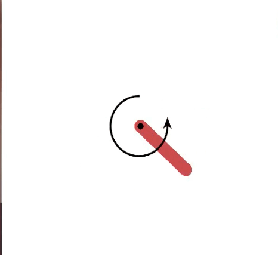
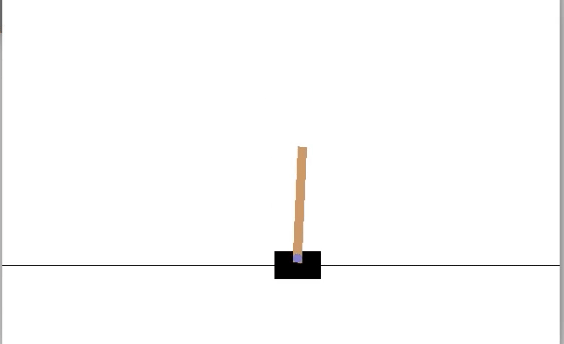

# WIP

The old working code for `PPO` is present in this branch. The framework based code is currently in the `devel` branch. Below are the details of the old `README.md`.

# Proximal Policy Optimization



An implementation of [Proximal Policy Optimization](https://arxiv.org/pdf/1707.06347.pdf) in julia.

Tested environments : 

```
CartPole-v0 Pendulum-v0
```

## Instructions To Run

<b>Training</b>

```
julia --project=Project.toml train.jl
```

<b>Testing</b>

```
julia --project=Project.toml test.jl
```

<b>Plot Rewards</b>

```
julia plot.jl
```

## Results




## Hyperparameters

```
# Environment Creation #
env_name = "CartPole-v0"
MODE = "CAT" # Can be either "CON" (Continuous) or "CON" (Categorical)

# Environment Variables #
STATE_SIZE = 4
ACTION_SIZE = 2

EPISODE_LENGTH = Int64(1e8)
REWARD_SCALING = 1.0 

# Policy parameters #
η = 3e-4 # Learning rate
HIDDEN_SIZE = 30

# GAE parameters
γ = 0.99
λ = 0.95

# Optimization parameters
PPO_EPOCHS = 10
NUM_EPISODES = 100000
BATCH_SIZE = 256
c₀ = 1.0
c₁ = 1.0
c₂ = 0.001

# PPO parameters
ϵ = 0.2

# FREQUENCIES
SAVE_FREQUENCY = 50
VERBOSE_FREQUENCY = 5
```

```
# Environment Creation #
env_name = "Pendulum-v0"
MODE = "CON" # Can be either "CON" (Continuous) or "CON" (Categorical)

# Environment Variables #
STATE_SIZE = 3
ACTION_SIZE = 1
EPISODE_LENGTH = 2000
TEST_STEPS = 10000
REWARD_SCALING = 16.2736044

# Policy parameters #
η = 3e-4 # Learning rate
STD = 0.0 # Standard deviation
HIDDEN_SIZE = 30

# GAE parameters
γ = 0.99
λ = 0.95

# Optimization parameters
PPO_EPOCHS = 10
NUM_EPISODES = 100000
BATCH_SIZE = 256
c₀ = 1.0
c₁ = 1.0
c₂ = 0.001

# PPO parameters
ϵ = 0.2

# FREQUENCIES
SAVE_FREQUENCY = 50
VERBOSE_FREQUENCY = 5

#---------Scale rewards-------#
function scale_rewards(rewards)
    return (rewards  ./ REWARD_SCALING) .+ 2.0f0
end
```
